<h2>TensorFlow-FlexUNet-Image-Segmentation-Multi-Sequence-Cardiac-MR (2026/06/10)</h2>

Sarah T. Arai 
Software Laboratory antillia.com 
 
This is the first experiment of Image Segmentation for <b>Multi-Sequence-Cardiac-MR (MSCMR) </b>,
 based on our 
TensorFlowFlexUNet (TensorFlow Flexible UNet Image Segmentation Model for Multiclass) 
and a 512x512 pixels PNG 
<a href="https://drive.google.com/file/d/1wWEOIUBTVe6U4CLRxfBfHW3Ru7MvXSkq/view?usp=sharing">
Augmented-MSCMR-ImageMask-Dataset.zip
</a> with colorized masks (<a href="https://www.mit.edu/~amini/LICENSE.md">MIT</a>), 
which was derived by us from    
<a href="https://www.kaggle.com/datasets/anhoangvo/mscmrseg">
<b>
MSCMRSeg
</b>
</a>
 
<b>Data for MS-CMRSeg 2019: Multi-sequence Cardiac MR Segmentation Challenge
</b> 
by An Hoang Vo.
 

<b>Acutual Image Segmentation for  MSCMR Images of 512x512 pixels</b> 
As shown below, the inferred masks predicted by our segmentation model trained on the 
PNG dataset appear similar to the ground truth masks.  
<a href="#color-class-mapping-table">MSCMR: class-color mapping table</a>
  
<table>
<tr>
<th>Input: image</th>
<th>Mask (ground_truth)</th>
<th>Prediction: inferred_mask</th>
</tr>
<tr>
<td>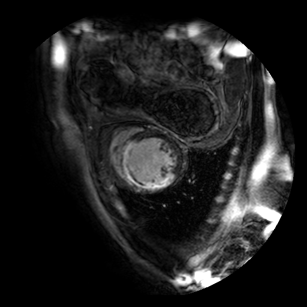</td>
<td></td>
<td>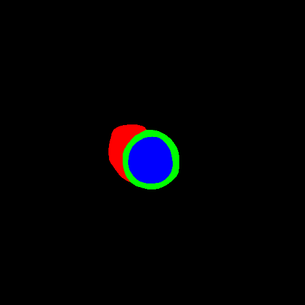</td>
</tr>
<tr>
<td>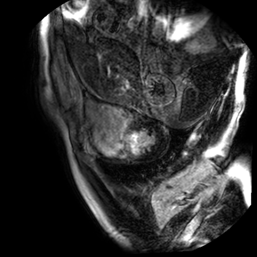</td>
<td>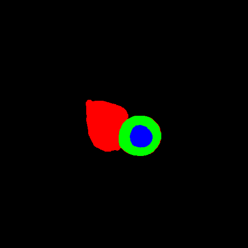</td>
<td>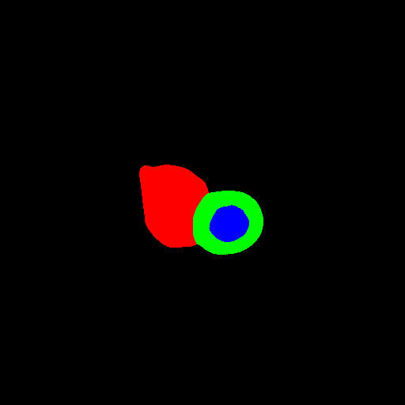</td>
</tr>
<tr>
<td>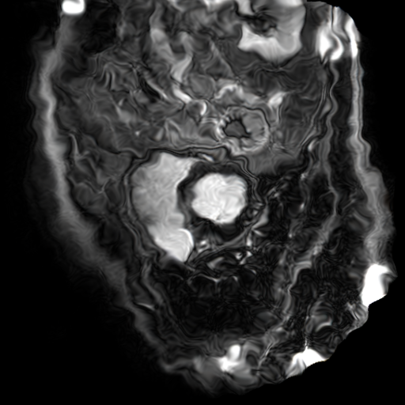</td>
<td>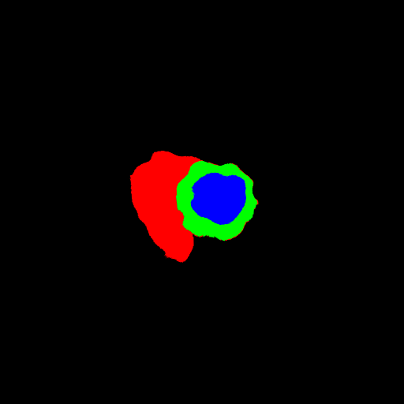</td>
<td>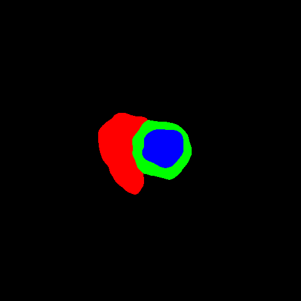</td>
</tr>
</table>

<h3>1. Dataset Citation</h3>
The dataset used here was derived from 
   
<a href="https://www.kaggle.com/datasets/anhoangvo/mscmrseg">
<b>
MSCMRSeg
</b>
</a>
 
<b>Data for MS-CMRSeg 2019: Multi-sequence Cardiac MR Segmentation Challenge
</b> 
by An Hoang Vo.
  
The following explanation was taken from the above web site.  
<b>About Dataset
</b> 
This preprocessed dataset, derived from the Multi-sequence Cardiac MR Segmentation Challenge (MSCMRSeg) 2019, is 
tailored for cardiac image segmentation tasks, specifically targeting left ventricle (LV), right ventricle (RV), 
and myocardium (MYO) segmentation. With multi-sequence cardiac magnetic resonance (MR) images and corresponding 
segmentation labels, researchers can delve into the intricacies of cardiac anatomy and pathology.
  
Moreover, this dataset is enriched with beautiful scribble annotations, serving as a valuable resource for scribble-supervised learning—a form of weakly supervised learning. The scribble annotation provided by paper: CycleMix: A Holistic Strategy for Medical Image Segmentation.
  
For access to the original challenge and detailed information, please visit the MSCMRSeg 2019 website:
<a href="https://zmiclab.github.io/zxh/0/mscmrseg19/index.html"> MSCMRSeg 2019.</a>
  
The preprocessed dataset is constructed using code from this <a href="https://github.com/labiip/FDDSeg/blob/923511713757b10b86fc34a6e9bc6a3776fb9152/FDDSeg-main/code/dataloaders/acdc_data_processing.py#L54">
GitHub repository</a>.
  
Researchers and practitioners can leverage this preprocessed dataset to advance segmentation algorithms, contribute to medical image analysis, and ultimately improve patient care in cardiovascular medicine.
  
<b>License</b> 
<a href="https://www.mit.edu/~amini/LICENSE.md">MIT</a>
  
<h3>
2 MSCMR ImageMask Dataset
</h3>
<h4>2.1 Download ImageMask Dataset</h4>
 If you would like to train this MSCMR Segmentation model by yourself,
 please download the dataset from the google drive 
<a href="https://drive.google.com/file/d/1wWEOIUBTVe6U4CLRxfBfHW3Ru7MvXSkq/view?usp=sharing">
Augmented-MSCMR-ImageMask-Dataset.zip
</a> (<a href="https://www.mit.edu/~amini/LICENSE.md">MIT</a>), 
expand the downloaded dataset, and put it under <b>./dataset</b> folder to be:
<pre>
./dataset
└─MSCMR
    ├─test
    │   ├─images
    │   └─masks
    ├─train
    │   ├─images
    │   └─masks
    └─valid
        ├─images
        └─masks
</pre>
 
<b>MSCMR Statistics</b> 
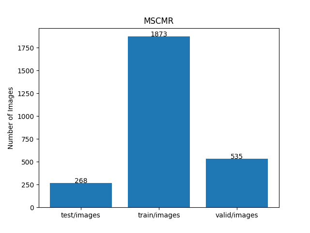 
 
As shown above, the number of images of train and valid datasets is large enough to use for a training set of our segmentation model.
 
 
<h4>2.2 ImageMask Dataset Derivation</h4>
The folder structure of <b>synapse dataset</b> is the following. 
<pre>
./MSCMR_preprocessed
  ├─MSCMR_testing_volumes
  │   ├─subject3_DE.h5
.. 
  │   └─subject43_DE.h5
...
  └─MSCMR_training_volumes
       ├─subject1_DE.h5
...
       └─subject41_DE.h5
</pre>
<b>Step 1</b> 
We used a simple Python script and the following color-class-mapping table to generatea a 512x512 pixels PNG master dataset 
with colorized masks from all pairs of images and their corressponding masks of H5 volume files in <b>MSCMR_testing_volumes</b> 
and <b>MSCMR_training_volumes</b>.  
<a id="color-class-mapping-table"><b>MSCMR color class mapping table</b></a>
  
<table border=1 style='border-collapse:collapse;' cellpadding='5'>
<tr><th>Indexed Color</th><th>Color</th><th>RGB</th><th>Class</th></tr>
<tr><td>0</td><td with='80' height='auto'></td><td>(0, 0, 0)</td><td>Background</td></tr>
<tr><td>1</td><td with='80' height='auto'></td><td>(255, 0, 0)</td><td>Left Ventricle (LV) </td></tr>
<tr><td>2</td><td with='80' height='auto'></td><td>(0, 255, 0)</td><td>Right Ventricle (RV)</td></tr>
<tr><td>3</td><td with='80' height='auto'></td><td>(0, 0, 255)</td><td>Myocardium (MYO)</td></tr>
</table>
 
For simplicity, we excluded all empty black label slices and their corresponding image slices to generate the PNG master, 
because they were irrelevant to training our segmentation model.
  
<b>Step 2</b> 
We generated our augmented dataset from the PNG master by using the following image deformation and distortion tools. 
<a href="https://github.com/sarah-antillia/Image-Deformation-Tool">Image-Deformation-Tool</a> 
<a href="https://github.com/sarah-antillia/Image-Distortion-Tool">Image-Distortion-Tool</a>  
<a href="https://github.com/sarah-antillia/Barrel-Image-Distortion-Tool">Barrel-Image-Distortion-Tool</a>  

 
<h4>2.3 Image and Mask samples</h4>
<b>Train sample images</b> 
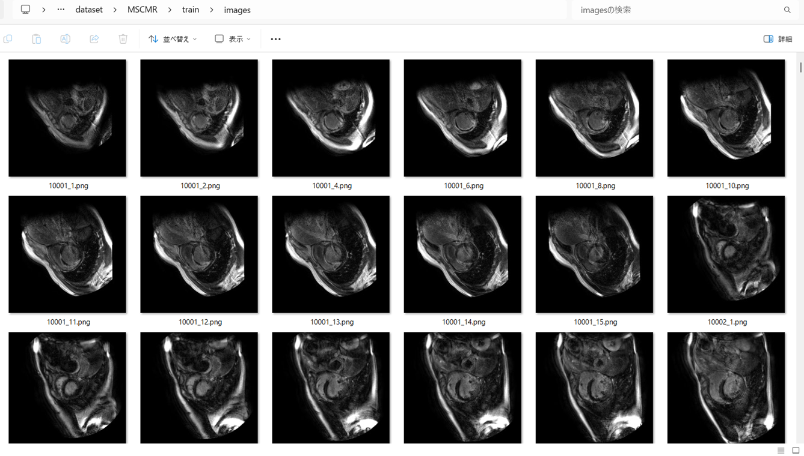
 
<b>Train sample masks</b> 
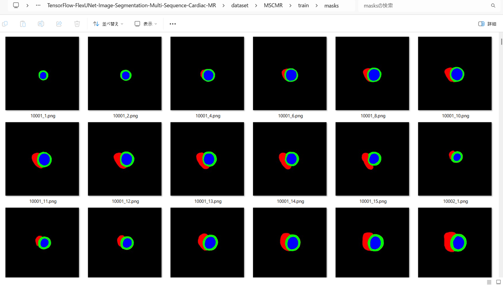
 
 
<h3>
3 Train TensorFlowFlexUNet Model
</h3>
 We trained MSCMR TensorFlowFlexUNet Model by using the following
<a href="./projects/TensorFlowFlexUNet/MSCMR/train_eval_infer.config"> <b>train_eval_infer.config</b></a> file.  
Please move to ./projects/TensorFlowFlexUNet/MSCMR and run the following bat file. 
<pre>
>1.train.bat
</pre>
, which simply runs the following command. 
<pre>
>python ../../../src/TensorFlowFlexUNetTrainer.py ./train_eval_infer.config
</pre>

<b>Model parameters</b> 
Defined a small <b>base_filters = 16 </b> and large <b>base_kernels = (11,11)</b> for the first Conv Layer of Encoder Block of 
<a href="./src/TensorFlowFlexUNet.py">TensorFlowFlexUNet.py</a> 
and a large <b>num_layers = 8</b> (including a bridge between Encoder and Decoder Blocks).
<pre>
[model]
;You may specify your own UNet class derived from our TensorFlowFlexModel
model         = "TensorFlowFlexUNet"
generator     =  False
image_width    = 512
image_height   = 512
image_channels = 3
num_classes    = 4
base_filters   = 16
base_kernels   = (11,11)
num_layers     = 8
dropout_rate   = 0.05
dilation       = (1,1)
</pre>
<b>Learning rate</b> 
Defined a very small learning rate.  
<pre>
[model]
learning_rate  = 0.00007
</pre>
<b>Loss and metrics functions</b> 
Specified "categorical_crossentropy" and <a href="./src/dice_coef_multiclass.py">"dice_coef_multiclass"</a>. 
<pre>
[model]
loss           = "categorical_crossentropy"
metrics        = ["dice_coef_multiclass"]
</pre>
<b>Dataset class</b> 
Specifed <a href="./src/ImageCategorizedMaskDataset.py">ImageCategorizedMaskDataset</a> class. 
<pre>
[dataset]
class_name    = "ImageCategorizedMaskDataset"
</pre>
 
<b>Learning rate reducer callback</b> 
Enabled learing_rate_reducer callback, and a small reducer_patience.
<pre> 
[train]
learning_rate_reducer = True
reducer_factor     = 0.5
reducer_patience   = 4
</pre>
<b>Early stopping callback</b> 
Enabled early stopping callback with patience parameter.
<pre>
[train]
patience      = 10
</pre>

<b>RGB Color map</b> 
rgb color map dict for MSCMR 1+8 classes. 
<pre>
[mask]
mask_datatyoe    = "categorized"
mask_file_format = ".png"
; MSCMR 1+3 classes
;          RGB colors; LV           RV          MYO 
rgb_map = {(0,0,0):0, (255,0,0):1, (0,255,0):2, (0,0,255):3 }
</pre>

<b>Epoch change inference callback</b> 
Enabled <a href="./src/EpochChangeInfereuncer.py">epoch_change_infer callback</a></b>. 
<pre>
[train]
epoch_change_infer       = True
epoch_change_infer_dir   =  "./epoch_change_infer"
num_infer_images         = 6
</pre>

By using this callback, on every epoch_change, the inference procedure can be called
 for 6 images in <b>mini_test</b> folder. This will help you confirm how the predicted mask changes 
 at each epoch during your training process.    

<b>Epoch_change_inference output at starting (epoch 1,2,3)</b> 
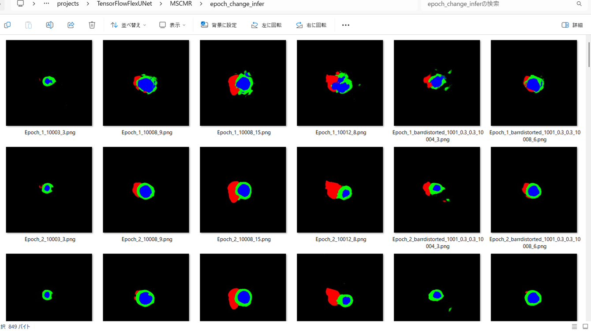 
 
<b>Epoch_change_inference output at middlepoint (epoch 13,14,15)</b> 
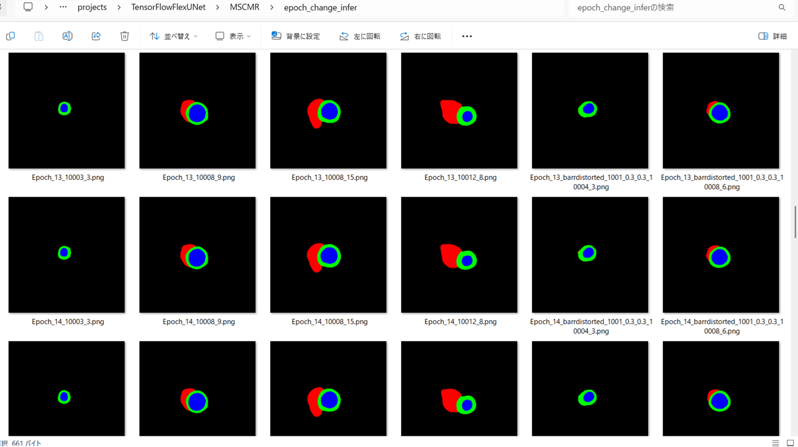 
 
<b>Epoch_change_inference output at ending (epoch 28,29,30)</b> 
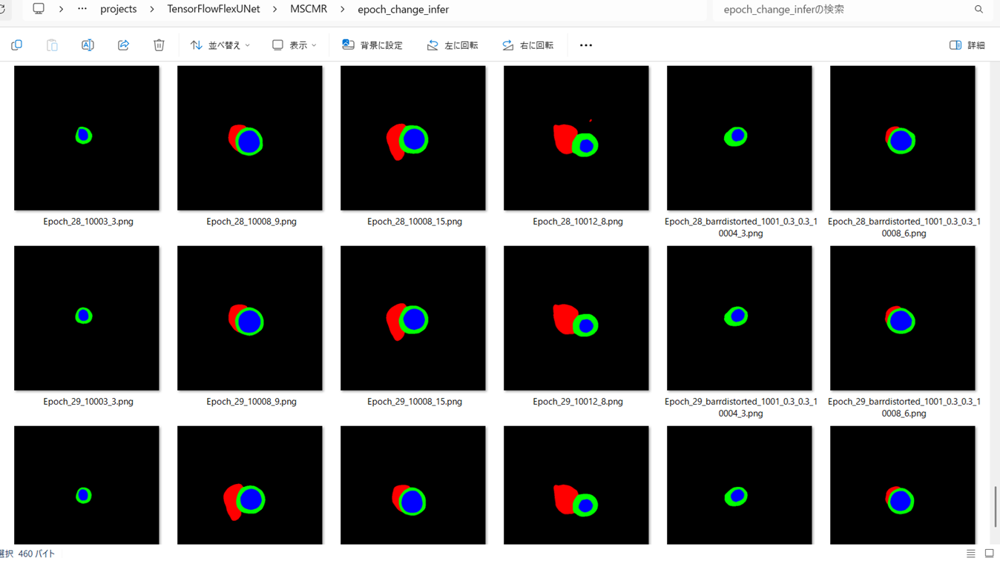 
 
In this experiment, the training process was terminated at epoch 30.  
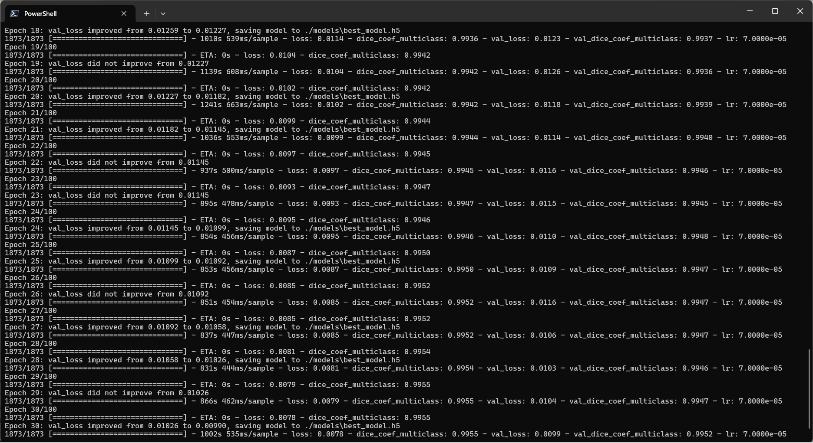 
 

<a href="./projects/TensorFlowFlexUNet/MSCMR/eval/train_metrics.csv">train_metrics.csv</a> 
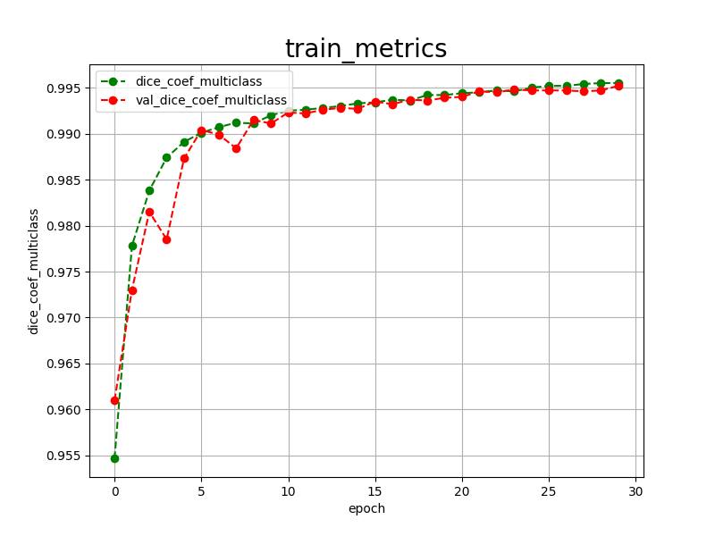 

 
<a href="./projects/TensorFlowFlexUNet/MSCMR/eval/train_losses.csv">train_losses.csv</a> 
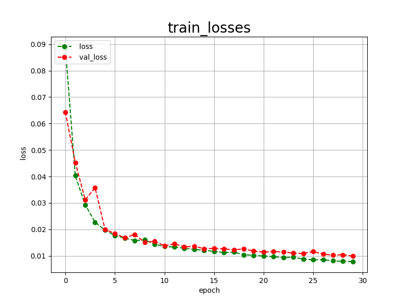 
 
<h3>
4 Evaluation
</h3>
Please move to <b>./projects/TensorFlowFlexUNet/MSCMR</b> folder, 
and run the following bat file to evaluate TensorFlowFlexUNet model for MSCMR. 
<pre>
./2.evaluate.bat
</pre>
This bat file simply runs the following command.
<pre>
python ../../../src/TensorFlowFlexUNetEvaluator.py ./train_eval_infer.config
</pre>

Evaluation console output: 
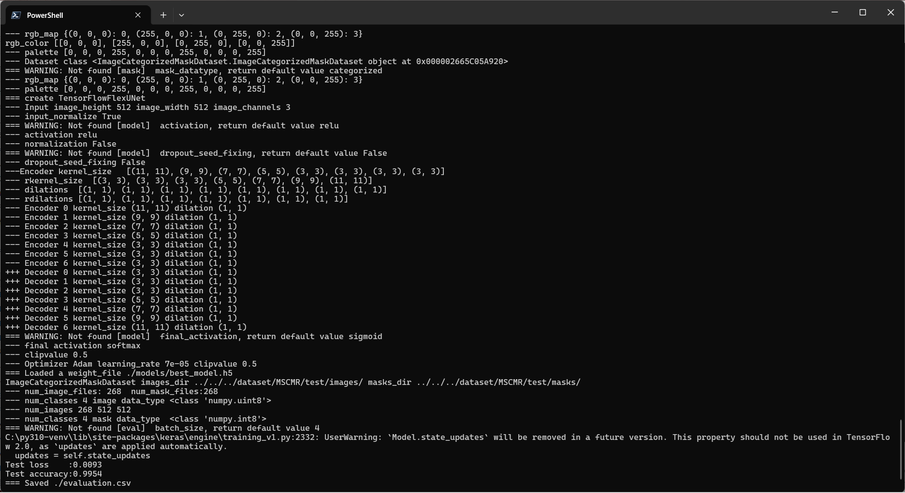
  

<a href="./projects/TensorFlowFlexUNet/MSCMR/evaluation.csv">evaluation.csv</a> 
The loss (categorical_crossentropy) to this MSCMR/test was very low, and dice_coef_multiclass very high as shown below.
 
<pre>
categorical_crossentropy,0.0093
dice_coef_multiclass,0.9954
</pre>
 

<h3>
5 Inference
</h3>
Please move to <b>./projects/TensorFlowFlexUNet/MSCMR</b> folder 
,and run the following bat file to infer segmentation regions for images by the Trained-TensorFlowFlexUNet model for MSCMR. 
<pre>
>./3.infer.bat
</pre>
This simply runs the following command.
<pre>
>python ../../../src/TensorFlowFlexUNetInferencer.py ./train_eval_infer.config
</pre>

<b>mini_test_images</b> 
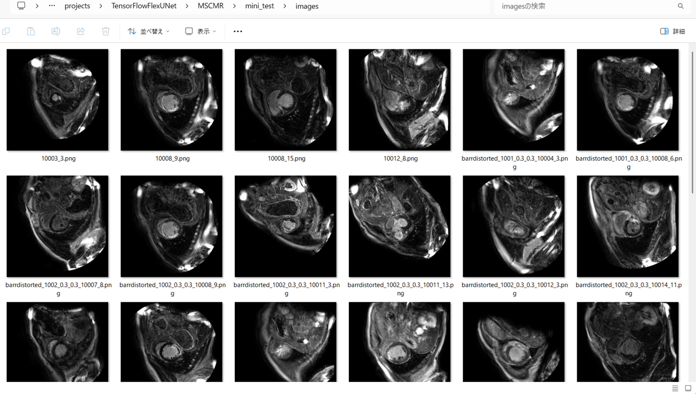 
<b>mini_test_mask(ground_truth)</b> 
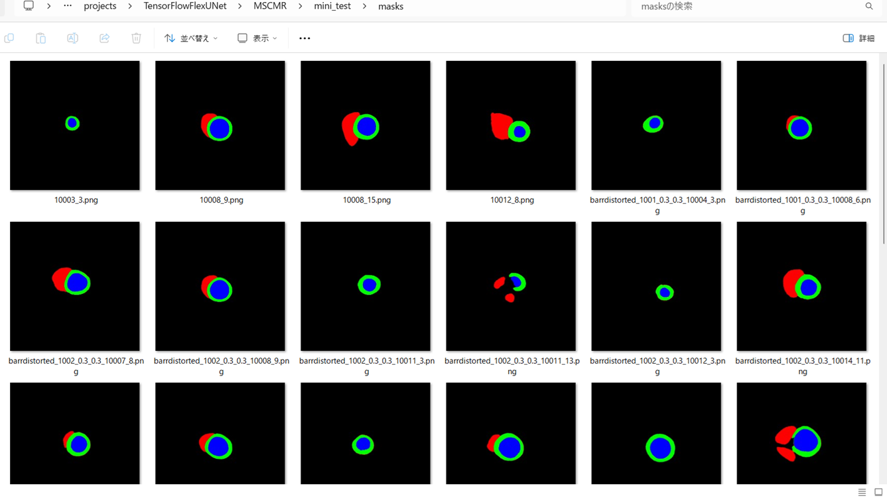 

<b>Inferred test masks</b> 
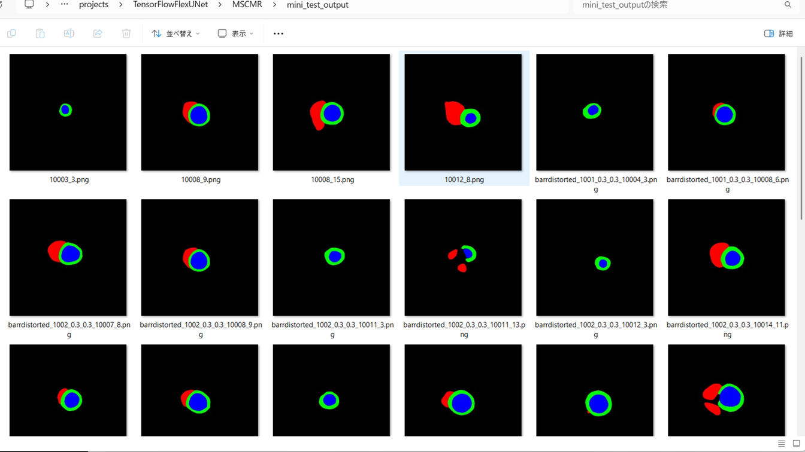 
 

<b>Enlarged images and masks for  MSCMR Images of 512x512 pixels</b> 
As shown below, the inferred masks predicted by our segmentation model trained on the 
PNG dataset appear similar to the ground truth masks.  
<a href="#color-class-mapping-table">MSCMR: class-color mapping table</a>
<table>
<tr>
<th>Image</th>
<th>Mask (ground_truth)</th>
<th>Inferred-mask</th>
</tr>

<tr>
<td></td>
<td></td>
<td></td>
</tr>

<tr>
<td>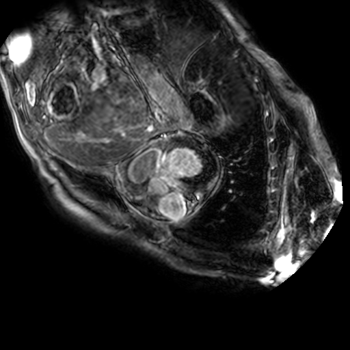</td>
<td>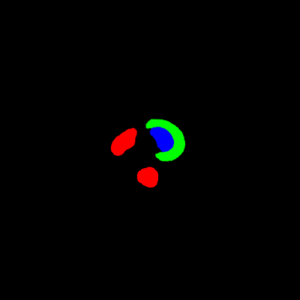</td>
<td></td>
</tr>

<tr>
<td>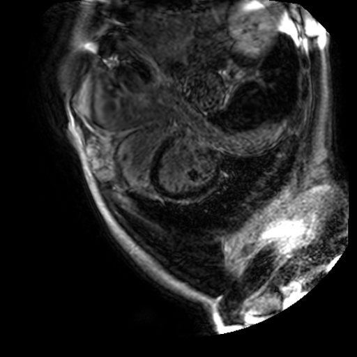</td>
<td>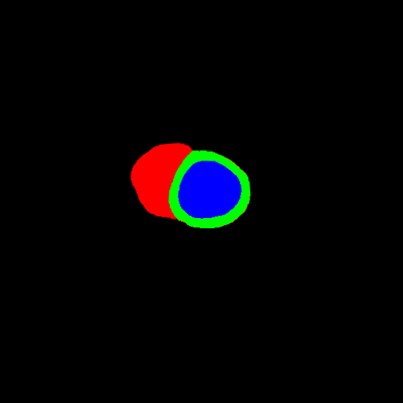</td>
<td></td>
</tr>

<tr>
<td>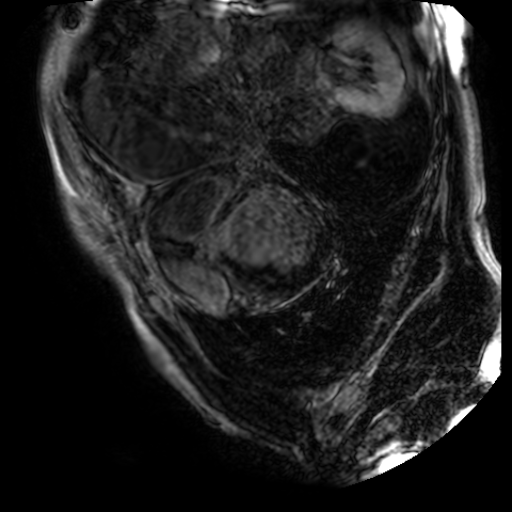</td>
<td>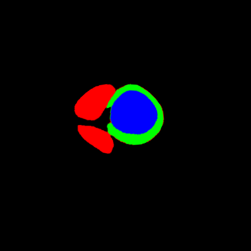</td>
<td>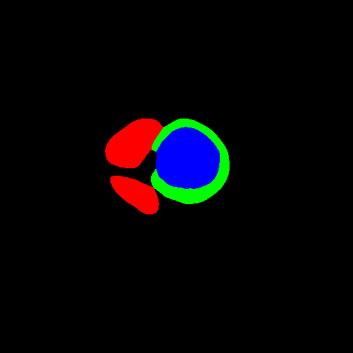</td>
</tr>

<tr>
<td></td>
<td></td>
<td></td>
</tr>

<tr>
<td>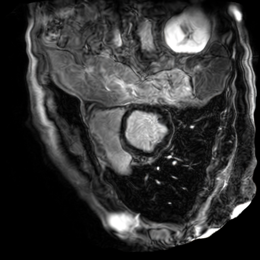</td>
<td>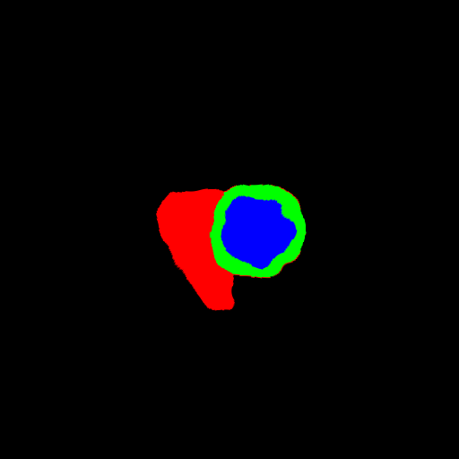</td>
<td>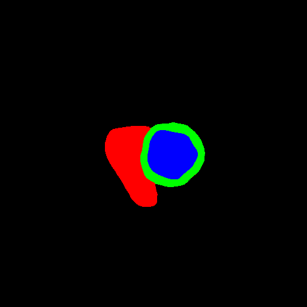</td>
</tr>
</table>

 

<h3>
6 3D Volume Segmentation
</h3>
Please move to <b>./projects/TensorFlowFlexUNet/MSCMR</b> folder 
,and run the following bat file to infer images segmentation for 2D slices of 3D volume NIfTI files
 by the Trained-TensorFlowFlexUNet model for MSCMR. 
<pre>
>./5.infer3d.bat
</pre>
This simply runs the following command.
<pre>
>python ../../../src/TensorFlowFlexUNet3DInferencer.py ./train_eval_infer.config
</pre>
<b>infer3d section </b> in <a href="./projects/TensorFlowFlexUNet/MSCMR/train_eval_infer.config">
train_eval_infer.config
<a></b>
<pre>
[infer3d] 
;Specify an images_dir which contains NIfTI, NPY or H5 files
images_dir    = "./mini_test_3d/images/"
output_dir    = "./mini_test_3d_output/"
slice_shape_order = "dhw"
slice_normalize = True
slice_resize   = (512,512)
;Specify a cv2.rotation code as a string.
slice_rotation = "cv2.ROTATE_90_CLOCKWISE" 
</pre>

<b>Acutual Image Segmentation for 2D Slices of a MSCMR NIfTI</b> 
Some Slices, Inferred Masks and Mask overlays for a 3D volume <b>subject11_DE.h5</b> file in <b>images_dir/sub-045</b> folder.
 folder. 
 
<a href="#color-class-mapping-table">MSCMR: class-color mapping table</a>
 
<table>
<tr>
<th>Image</th>
<th>Inferred-mask</th>
<th>Mask overlay</th>
</tr>

<tr>
<td>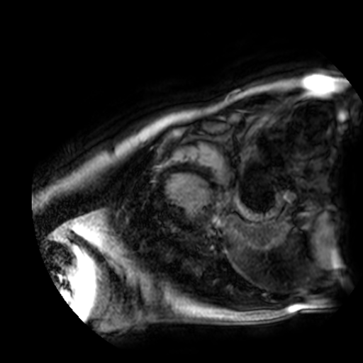</td>
<td>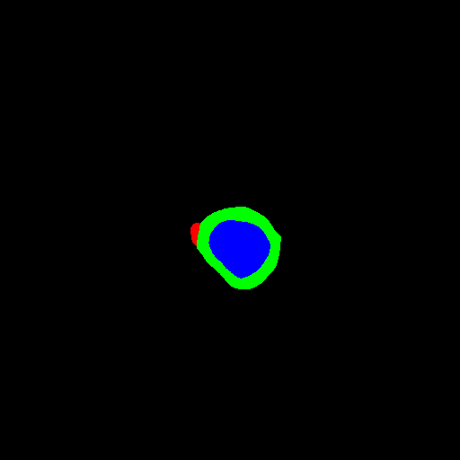</td>
<td>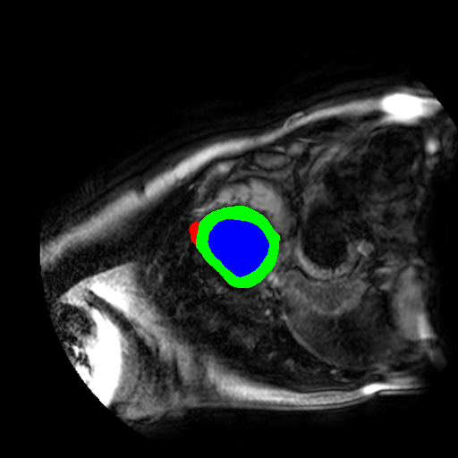</td>
</tr>

<tr>
<td>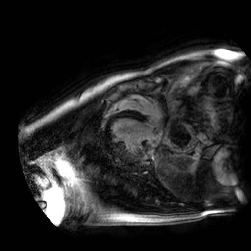</td>
<td>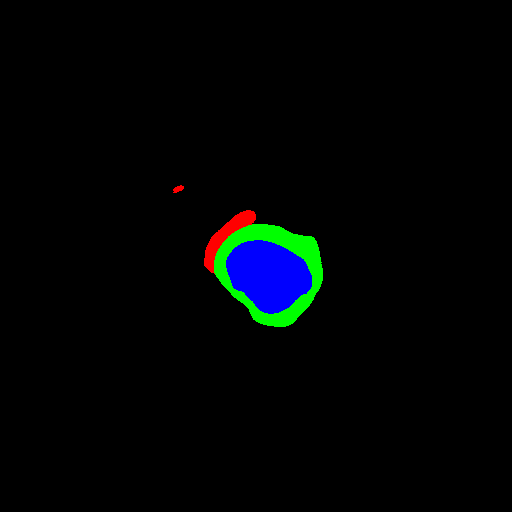</td>
<td>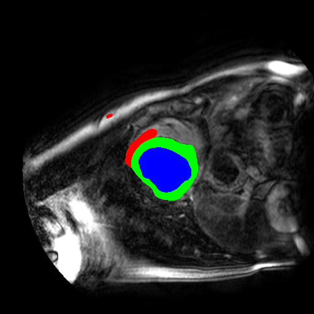</td>
</tr>
<tr>
<td>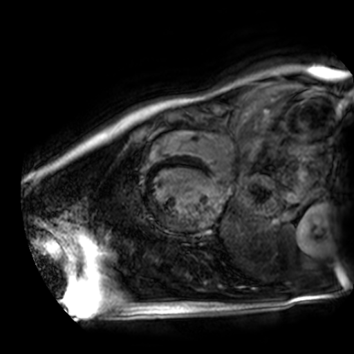</td>
<td>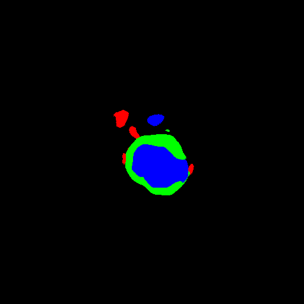</td>
<td>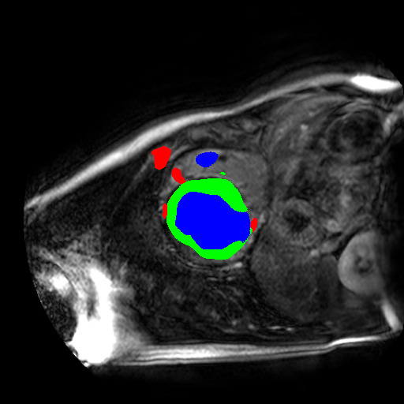</td>
</tr>
<tr>
<td>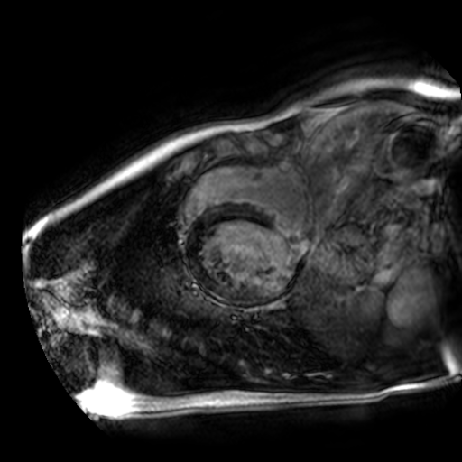</td>
<td>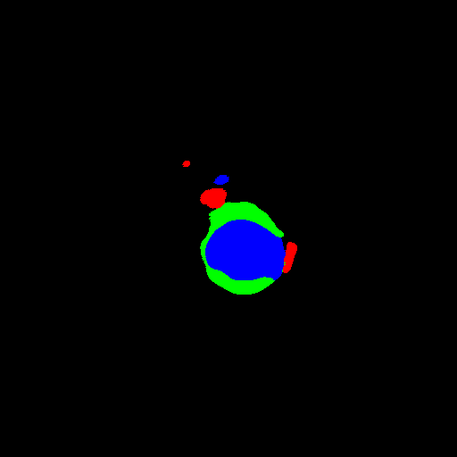</td>
<td>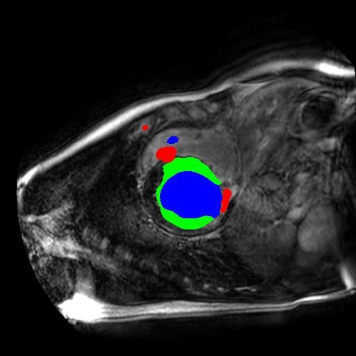</td>
</tr>
<tr>
<td>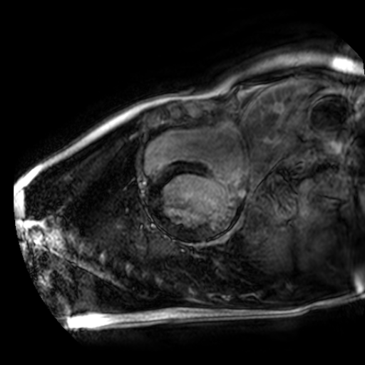</td>
<td>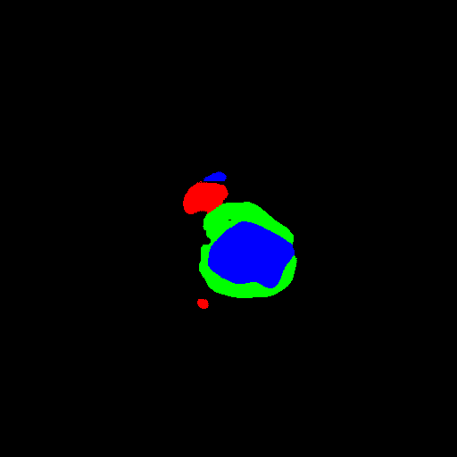</td>
<td>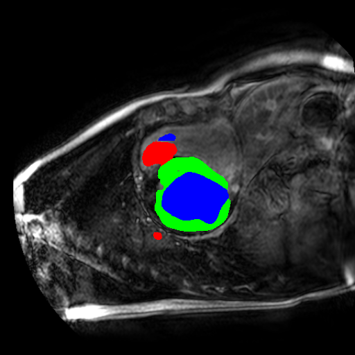</td>
</tr>
<tr>
<td>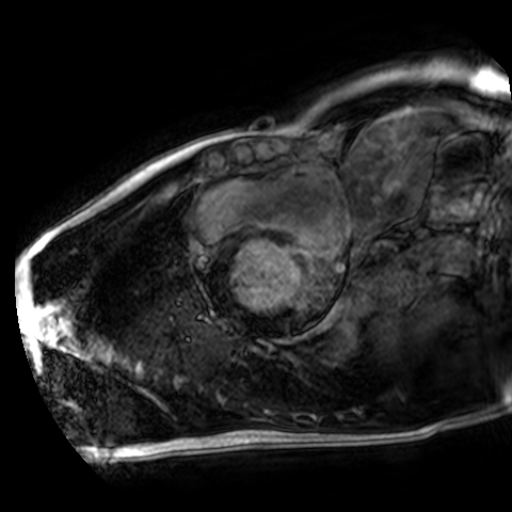</td>
<td>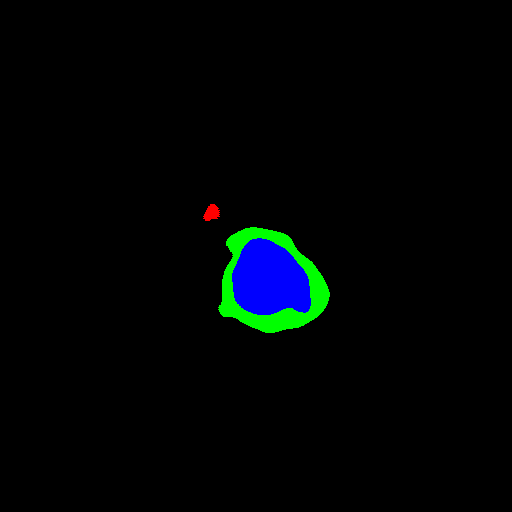</td>
<td>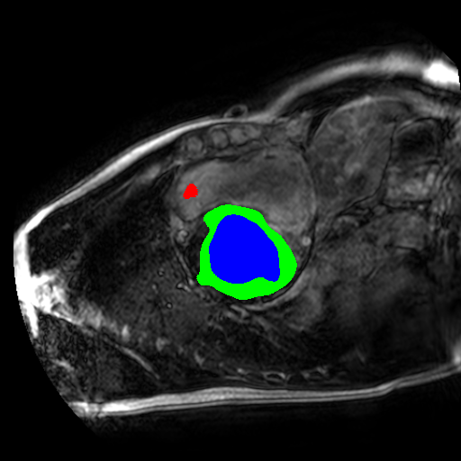</td>
</tr>

</table>

 
<h3>
7 MaskOverlay Video of 3D Volume Segmentation
</h3>
Please move to <b>./projects/TensorFlowFlexUNet/MSCMR</b> folder, and run the following bat file 
to generate <b>overlays.mp4</b> or <b>overlay.gif</b> for MaskOverlays of 3D Volume Segmentation.  
<pre>
>./6.video3d.bat
</pre>
This simply runs the following command.
<pre>
>python ../../../src/MaskOverlayVideoGenerator.py ./train_eval_infer.config
</pre>
 
<b>infer3d section </b> in <a href="./projects/TensorFlowFlexUNet/MSCMR/train_eval_infer.config">
train_eval_infer.config
<a></b>
<pre>
[infer3d] 
mask_overlay  = True
;Specify ".mp4" or ".gif".
;video_fileformat  = ".mp4"
video_fileformat  = ".gif"
</pre>
 
<b>overlays.gif</b> 
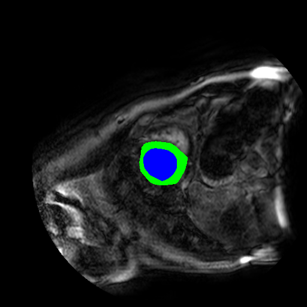
 
 
<h3>
References
</h3>
<b>1. TensorFlow-FlexUNet-Image-Segmentation-Congenital-Heart-Disease</b> 
Toshiyuki Arai 
<a href="https://github.com/sarah-antillia/TensorFlow-FlexUNet-Image-Segmentation-Congenital-Heart-Disease">
https://github.com/sarah-antillia/TensorFlow-FlexUNet-Image-Segmentation-Congenital-Heart-Disease</a>
  
<b>2. TensorFlow-FlexUNet-Image-Segmentation-Whole-Heart-HVSMR-2.0</b> 
Toshiyuki Arai 
<a href="https://github.com/sarah-antillia/TensorFlow-FlexUNet-Image-Segmentation-Whole-Heart-HVSMR-2.0">
https://github.com/sarah-antillia/TensorFlow-FlexUNet-Image-Segmentation-Whole-Heart-HVSMR-2.0</a>
  
<b>3. TensorFlow-FlexUNet-Image-Segmentation-Model</b> 
Toshiyuki Arai 
<a href="https://github.com/sarah-antillia/TensorFlow-FlexUNet-Image-Segmentation-Model">
https://github.com/sarah-antillia/TensorFlow-FlexUNet-Image-Segmentation-Model
</a>

